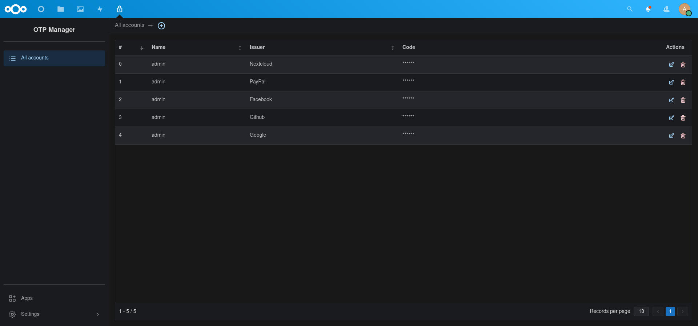

<!--
SPDX-FileCopyrightText: Matteo Convertino <matteo@convertino.cloud>
SPDX-License-Identifier: CC0-1.0
-->

# OTP Manager

*Read this in other languages: [Italian](README.it.md)*

*Official Nextcloud OTP Manager app repository: [otpmanager-app](https://github.com/matteo-convertino/otpmanager-app)*

*Nextcloud App Store: [otpmanager](https://apps.nextcloud.com/apps/otpmanager)*

# Screenshots


# Description
OTP Manager is useful for those who use two-factor authentication (2FA) and want to manage their OTP codes securely and easily. 
This application allows you to synchronize your OTP codes with your personal Nextcloud server so that you can access them from any device.

With OTP Manager, you no longer have to worry about losing your OTP codes or not having access to them when you need them. 
All you have to do is synchronize your app with your Nextcloud server and you will always have your OTP codes at hand, wherever you are.

OTP Manager offers the convenient feature of importing OTP codes from Google Authenticator by scanning the QR code. 
This means you don't have to worry about having to manually enter every single OTP code, but can simply scan the QR code that the Google app generates when exporting 
accounts, and OTP Manager will automatically import your associated accounts.

This way, the migration from Google Authenticator to OTP Manager will be quick and easy, without having to waste time manually resetting all your OTP codes.

# Manual Installation

If you want to install it manually, you have to run these steps:

- clone repository inside your `custom_apps` folder
- set `'debug' => true` in `config/config.php` file:
```
$CONFIG = array (
    'debug' => true,
    ... configuration goes here ...
);

```
- enable app into Nextcloud apps section

- run this command to create all the tables: 
```
php ./occ migrations:execute <app-folder-name> <version-number>
```
> To get the `<version-number>` you can run this command:
> ```
> php ./occ migrations:status <app-folder-name>
> ```
> and check the `Latest Version`.

- Finally run these commands to install all dependencies:
```
npm install
make composer
```
    
# Planned Features
- [ ] Implement research
- [ ] Develop the possibility of setting a password to access accounts
- [ ] Be able to move accounts into the datatable
- [ ] Encrypt secret keys in the database
- [ ] Develop recycle bin
- [ ] Multiple elimination
- [ ] [Backup accounts and codes](https://github.com/matteo-convertino/otpmanager-nextcloud/issues/2)
